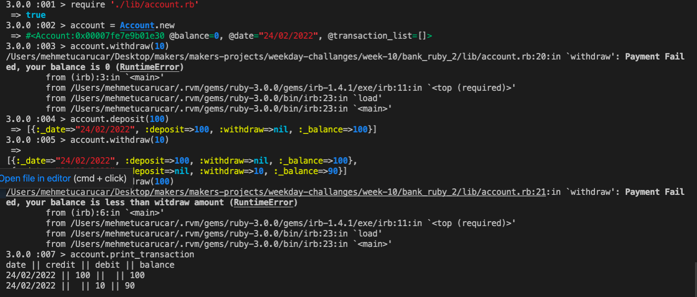

## User Stories:

As a bank customer,
So that I can use the banks services,
I would like to create a bank account.

As a bank customer,
So that I can buy stuff with my card,
I would like to be able to deposit money to my bank account.

As a bank customer,
So that I can have some cash,
I would like to be able to withdraw money from my bank account.

As a bank,
So that I don't lose money,
I won't let customers withdraw if their balance is 0.

As a bank,
So that I don't lose money,
I won't let customers withdraw if balance is less than withdraw amount.

As a bank customer,
So that I can keep track of my finances,
I would like to be able to print a bank statement.

As a bank customer,
So that I can keep track of when I spent money,
I would like my statement to include date for activity.


# How to use the program

Clone this repo and run bundle to install all the gems: 

```
git clone https://github.com/robinucar/Bank_ruby_2.git
bundle
```

irb
require './lib/account.rb'
```
Here is an example of program command:

```
account = Account.new


account.deposit(100)

account.withdraw(10)

account.print_transaction

```
shows following output
```
date || credit || debit || balance
24/02/2022 || 100 ||  || 100                         
24/02/2022 ||  || 10 || 90           
```
## How to run the tests
``` 
rspec
```
98.04 test coverage.

## Screenshot of app running in the terminal



## Approach

- I planned the domain using paper and pen, defining the methods
    Account class deals with making deposits , withdraws save_transaction and print_transaction 

- I used terminal table gem to print table on the terminal
- I tested all my code with irb
- I tested all restriction which are not be able to withdraw if balance is 0 or if balance is less than withdraw amount


